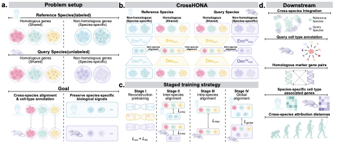

# CrossHONA



CrossHONA is a deep learning framework for cross-species single-cell RNA-seq and spatial transcriptomics integration and cell type annotation. The model jointly incorporates homologous and non-homologous genes within a unified latent embedding space to capture both conserved and species-specific biological signals.

## Repository Structure

- `CrossHONA/`
  - Core model implementation and training pipeline
  - Includes staged training scripts, dataset loaders, and preprocessing utilities

- `CrossHONA-Agent/`
  - Optional Gradio-based interface and utility scripts for experiment management and visualization
  - See `CrossHONA-Agent/DOCKER.md` for the containerized deployment alternative

- `SETUP_AGENT.md`
  - Full setup, daily start-up, troubleshooting, and example chat-tab session for the agent + web UI

- `environment.yml`
  - Conda environment specification

## Installation

```bash
git clone https://github.com/anonreview412/CrossHONA.git
cd CrossHONA

conda env create -f environment.yml
conda activate crossspecies
```
## Usage
Example training scripts are provided in:

```bash
CrossHONA/run_*.sh
```
Users should prepare their own datasets following the preprocessing procedure described in the manuscript. Before running, edit codedir, datadir, resultdir placeholders to point at your local paths.

## Requirements
- Linux
- Python 3.10
- CUDA-enabled GPU
- Conda or Miniforge

## License

See [LICENSE](LICENSE).
